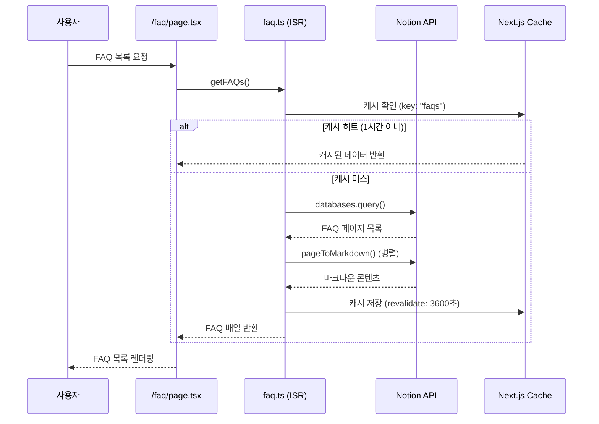
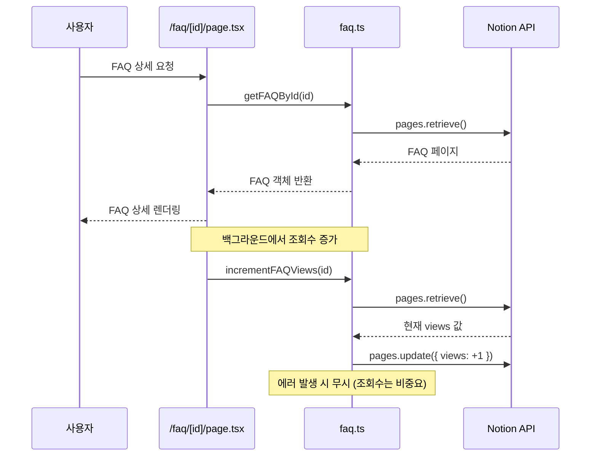
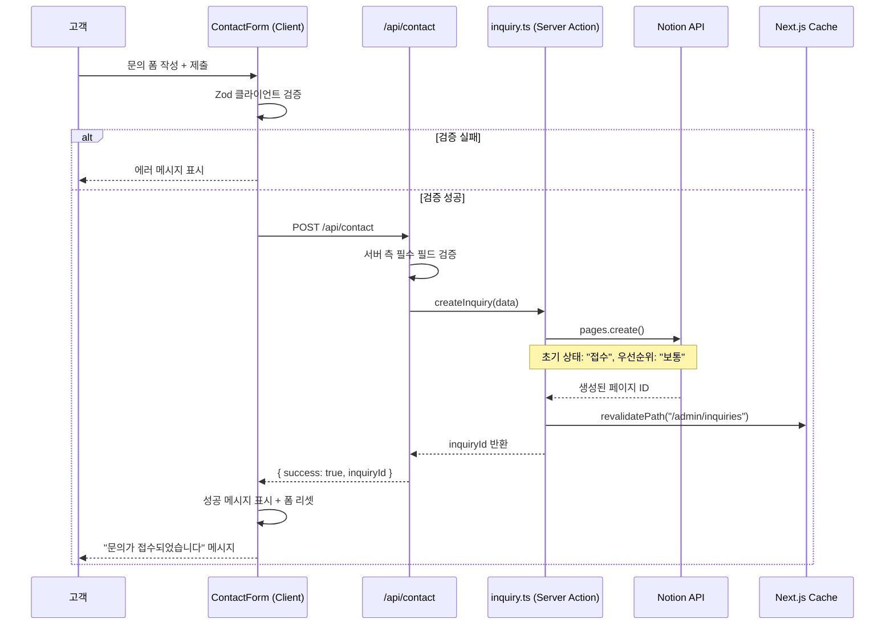
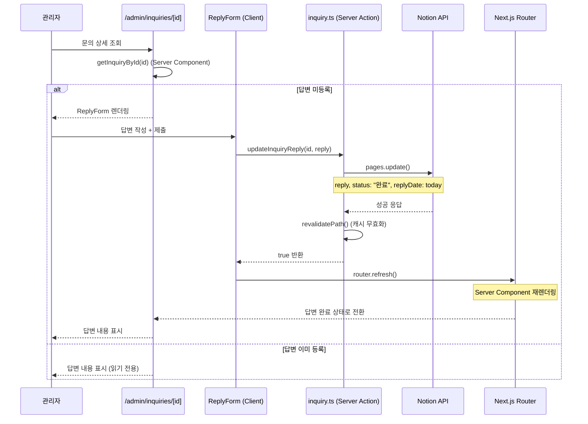

# FAQ 및 문의 자동화 시스템 기술 문서

> PRESSCO 21 프로젝트 — Notion CMS 기반 고객 지원 자동화
> 작성일: 2026-02-11
> 작성자: Claude Sonnet 4.5

---

## 목차

1. [시스템 개요](#시스템-개요)
2. [데이터 흐름 다이어그램](#데이터-흐름-다이어그램)
3. [핵심 패턴](#핵심-패턴)
4. [타입 시스템](#타입-시스템)
5. [보안 및 검증](#보안-및-검증)
6. [파일 구조](#파일-구조)
7. [확장 포인트](#확장-포인트)
8. [트러블슈팅](#트러블슈팅)

---

## 시스템 개요

### 목표
- **FAQ 자동화**: 자주 묻는 질문을 노션 DB에서 관리하고 조회수를 자동으로 추적
- **문의 접수**: 고객 문의를 폼으로 받아 노션 DB에 저장하고 관리자가 답변
- **ISR 캐싱**: Next.js의 ISR(Incremental Static Regeneration)으로 성능 최적화

### 기술 스택
- **Next.js 16** (App Router, Server Components, Server Actions)
- **Notion Official SDK** (`@notionhq/client` + `notion-to-md`)
- **React Hook Form** + **Zod** (클라이언트 검증)
- **Tailwind CSS v4** + **shadcn/ui** (UI)

### 아키텍처 원칙
1. **Server-First**: 데이터 페칭은 서버에서만 수행 (보안)
2. **ISR 캐싱**: 정적 생성 + 주기적 재검증으로 성능 최적화
3. **타입 안전성**: TypeScript로 전체 데이터 흐름 타입 보장
4. **단방향 흐름**: 클라이언트 → API Route → Server Action → Notion API

---

## 데이터 흐름 다이어그램

### FAQ 조회 흐름



### FAQ 상세 조회 + 조회수 증가



### 문의 접수 흐름



### 답변 처리 흐름



---

## 핵심 패턴

### 1. Notion SDK 초기화 패턴

```typescript
// src/lib/faq.ts, src/lib/inquiry.ts 공통

function getNotionClient(): Client {
  if (!process.env.NOTION_TOKEN) {
    throw new Error("[Notion] NOTION_TOKEN 환경 변수가 설정되지 않았습니다.");
  }

  return new Client({ auth: process.env.NOTION_TOKEN });
}
```

**특징:**
- 환경 변수 누락 시 명확한 에러 메시지
- 타입 별칭 사용 금지 (`Client` 직접 반환)
- 함수 호출마다 새 인스턴스 생성 (상태 공유 방지)

---

### 2. ISR 캐싱 패턴

```typescript
// src/lib/faq.ts

export async function getFAQs(): Promise<FAQ[]> {
  const client = getNotionClient();
  const dbId = process.env.NOTION_DB_FAQS;

  if (!dbId) {
    console.warn("[FAQ] NOTION_DB_FAQS 환경 변수가 설정되지 않았습니다.");
    return [];
  }

  return unstable_cache(
    async () => {
      try {
        const response = await client.databases.query({
          database_id: dbId,
          sorts: [
            { property: "category", direction: "ascending" },
            { property: "order", direction: "ascending" },
          ],
        });

        // ... 데이터 변환 로직
        return faqs.filter(faq => faq !== null && faq.published);
      } catch (error) {
        console.error("[FAQ] getFAQs 에러:", error);
        return []; // 에러 발생 시 빈 배열 (빌드 실패 방지)
      }
    },
    ["faqs"], // 캐시 키
    { revalidate: 3600, tags: ["faqs"] } // 1시간 캐시 + 태그
  )();
}
```

**캐싱 전략:**
- **목록 페이지**: `revalidate: 3600` (1시간) — 변경 빈도 낮음
- **상세 페이지**: `revalidate: 600` (10분) — 조회수 증가 반영
- **태그 기반 재검증**: `tags: ["faqs"]` — 수동 재검증 가능

**에러 처리:**
- try-catch로 감싸서 빈 배열/null 반환
- 프로덕션 빌드 실패 방지 (Notion API 장애 시에도 빌드 성공)

---

### 3. Server Actions 패턴

```typescript
// src/actions/inquiry.ts

"use server";

import { revalidatePath } from "next/cache";
import { Client } from "@notionhq/client";

export async function createInquiry(data: {
  title: string;
  name: string;
  email: string;
  phone: string;
  category: string;
  message: string;
}): Promise<string | null> {
  const client = getNotionClient();
  const dbId = process.env.NOTION_DB_INQUIRIES;

  if (!dbId) {
    console.error("[Inquiry] NOTION_DB_INQUIRIES 환경 변수가 설정되지 않았습니다.");
    return null;
  }

  try {
    const response = await client.pages.create({
      parent: { database_id: dbId },
      properties: {
        title: { title: [{ text: { content: data.title } }] },
        name: { rich_text: [{ text: { content: data.name } }] },
        email: { email: data.email },
        phone: { phone_number: data.phone },
        category: { select: { name: data.category } },
        message: { rich_text: [{ text: { content: data.message } }] },
        status: { select: { name: "접수" } }, // 초기 상태 고정
        priority: { select: { name: "보통" } }, // 초기 우선순위 고정
      },
    });

    // ISR 캐시 재검증 (관리자 페이지)
    revalidatePath("/admin/inquiries");

    return response.id;
  } catch (error) {
    console.error("[Inquiry] createInquiry 에러:", error);
    return null;
  }
}
```

**Server Actions 특징:**
- `"use server"` 지시어로 서버 전용 함수 선언
- `revalidatePath()`로 ISR 캐시 즉시 무효화
- 클라이언트에서 직접 호출 가능 (API Route 불필요)
- 환경 변수 접근 가능 (클라이언트 노출 방지)

**상태 자동 변경:**
- `createInquiry()` → `status: "접수"`, `priority: "보통"`
- `updateInquiryReply()` → `status: "완료"`, `replyDate: today`

---

### 4. Notion 속성 추출 패턴

```typescript
// src/lib/faq.ts, src/lib/inquiry.ts 공통

function getProp(
  page: PageObjectResponse,
  key: string,
): string | number | boolean | null {
  const prop = page.properties[key];
  if (!prop) return "";

  switch (prop.type) {
    case "title":
      return prop.title[0]?.plain_text ?? "";
    case "rich_text":
      return prop.rich_text[0]?.plain_text ?? "";
    case "email":
      return prop.email ?? "";
    case "phone_number":
      return prop.phone_number ?? "";
    case "number":
      return prop.number ?? 0;
    case "select":
      return prop.select?.name ?? "";
    case "checkbox":
      return prop.checkbox ?? false;
    case "date":
      return prop.date?.start ?? null;
    case "created_time":
      return prop.created_time ?? "";
    default:
      return "";
  }
}
```

**안전성:**
- Optional chaining (`?.`) + Nullish coalescing (`??`)으로 안전한 기본값
- 타입별 분기 처리로 런타임 에러 방지

---

### 5. 클라이언트 폼 검증 패턴

```typescript
// src/app/contact/_components/contact-form.tsx

import { z } from "zod";

const contactSchema = z.object({
  name: z.string().min(1, "이름을 입력해주세요"),
  email: z.string().email("올바른 이메일 형식을 입력해주세요"),
  phone: z.string().regex(
    /^01[0-9]-?[0-9]{3,4}-?[0-9]{4}$/,
    "올바른 전화번호 형식을 입력해주세요 (예: 010-1234-5678)",
  ),
  category: z.enum(["상품 문의", "주문/배송", "반품/교환", "일반 문의", "제안", "불만", "기타"]),
  title: z.string().min(1, "제목을 입력해주세요").max(100, "제목은 100자 이내로 입력해주세요"),
  message: z.string().min(10, "문의 내용을 10자 이상 입력해주세요").max(1000, "문의 내용은 1000자 이내로 입력해주세요"),
});

const { register, handleSubmit, formState: { errors } } = useForm<ContactFormData>({
  resolver: zodResolver(contactSchema),
});
```

**Zod 검증 장점:**
- 타입 안전성 (`z.infer<typeof schema>` → TypeScript 타입 자동 생성)
- 명확한 에러 메시지 (한국어)
- 정규식 검증 (전화번호, 이메일)
- 최소/최대 길이 검증

---

## 타입 시스템

### FAQ 타입

```typescript
// src/types/faq.ts

export type FAQCategory = "배송" | "결제" | "교환/환불" | "상품" | "기타";

export interface FAQ {
  id: string;
  title: string;
  category: FAQCategory;
  order: number;           // 정렬 순서
  published: boolean;      // 발행 여부
  views: number;           // 조회수
  content: string;         // 마크다운 콘텐츠
  createdTime: string;     // 생성 날짜 (ISO 8601)
}

export const FAQ_CATEGORY_COLORS: Record<FAQCategory, string> = {
  배송: "bg-blue-100 text-blue-800 dark:bg-blue-900 dark:text-blue-200",
  결제: "bg-green-100 text-green-800 dark:bg-green-900 dark:text-green-200",
  "교환/환불": "bg-orange-100 text-orange-800 dark:bg-orange-900 dark:text-orange-200",
  상품: "bg-purple-100 text-purple-800 dark:bg-purple-900 dark:text-purple-200",
  기타: "bg-gray-100 text-gray-800 dark:bg-gray-900 dark:text-gray-200",
} as const;
```

---

### Inquiry 타입

```typescript
// src/types/inquiry.ts

export type InquiryCategory =
  | "상품 문의"
  | "주문/배송"
  | "반품/교환"
  | "일반 문의"
  | "제안"
  | "불만"
  | "기타";

export type InquiryStatus = "접수" | "처리중" | "완료";
export type InquiryPriority = "낮음" | "보통" | "높음" | "긴급";

export interface Inquiry {
  id: string;
  title: string;
  name: string;
  email: string;
  phone: string;
  category: InquiryCategory;
  message: string;
  status: InquiryStatus;
  priority: InquiryPriority;
  reply: string | null;       // 답변 내용
  replyDate: string | null;    // 답변 날짜 (ISO 8601)
  createdTime: string;         // 접수 날짜 (ISO 8601)
}

export const INQUIRY_STATUS_COLORS: Record<InquiryStatus, string> = {
  접수: "bg-blue-100 text-blue-800 dark:bg-blue-900 dark:text-blue-200",
  처리중: "bg-yellow-100 text-yellow-800 dark:bg-yellow-900 dark:text-yellow-200",
  완료: "bg-green-100 text-green-800 dark:bg-green-900 dark:text-green-200",
} as const;

export const INQUIRY_PRIORITY_COLORS: Record<InquiryPriority, string> = {
  낮음: "bg-gray-100 text-gray-800 dark:bg-gray-900 dark:text-gray-200",
  보통: "bg-blue-100 text-blue-800 dark:bg-blue-900 dark:text-blue-200",
  높음: "bg-orange-100 text-orange-800 dark:bg-orange-900 dark:text-orange-200",
  긴급: "bg-red-100 text-red-800 dark:bg-red-900 dark:text-red-200",
} as const;
```

---

## 보안 및 검증

### 이중 검증 전략

```
클라이언트 검증 (Zod)
    ↓
API Route 검증 (필수 필드)
    ↓
Notion API 검증 (스키마)
```

#### 1. 클라이언트 검증 (React Hook Form + Zod)
```typescript
// src/app/contact/_components/contact-form.tsx

const contactSchema = z.object({
  email: z.string().email("올바른 이메일 형식을 입력해주세요"),
  phone: z.string().regex(/^01[0-9]-?[0-9]{3,4}-?[0-9]{4}$/),
  message: z.string().min(10).max(1000),
});
```

**목적**: 사용자 경험 개선 (즉시 피드백)

#### 2. 서버 검증 (API Route)
```typescript
// src/app/api/contact/route.ts

export async function POST(request: Request) {
  const { name, email, phone, category, title, message } = await request.json();

  if (!name || !email || !phone || !category || !title || !message) {
    return NextResponse.json(
      { error: "필수 필드가 누락되었습니다." },
      { status: 400 },
    );
  }

  // ... createInquiry() 호출
}
```

**목적**: 보안 (클라이언트 검증 우회 방지)

#### 3. Notion API 검증
- 이메일 형식 자동 검증 (`email` 타입)
- 전화번호 형식 자동 검증 (`phone_number` 타입)
- Select 옵션 불일치 시 에러 반환

---

### 환경 변수 보안

```env
# .env.local (서버 전용, 클라이언트 노출 안 됨)

NOTION_TOKEN=secret_***
NOTION_DB_FAQS=db_id_***
NOTION_DB_INQUIRIES=db_id_***
```

**규칙:**
- `NEXT_PUBLIC_*` 접두사 없음 → 클라이언트 노출 안 됨
- Server Components/Actions에서만 접근 가능
- Vercel 환경 변수로 프로덕션 배포 시 자동 주입

---

### XSS 방지

FAQ/Inquiry의 `message` 필드는 마크다운으로 렌더링되지 않고 **일반 텍스트로만 표시**.

```typescript
// ❌ XSS 취약: dangerouslySetInnerHTML
<div dangerouslySetInnerHTML={{ __html: inquiry.message }} />

// ✅ 안전: 일반 텍스트
<p className="whitespace-pre-wrap">{inquiry.message}</p>
```

---

## 파일 구조

```
src/
├── lib/
│   ├── faq.ts                  # FAQ 데이터 페칭 (ISR 캐싱)
│   └── inquiry.ts              # 문의 데이터 페칭 (ISR 캐싱)
├── actions/
│   └── inquiry.ts              # Server Actions (createInquiry, updateInquiryReply)
├── types/
│   ├── faq.ts                  # FAQ 타입 정의
│   └── inquiry.ts              # Inquiry 타입 정의
├── app/
│   ├── faq/
│   │   ├── page.tsx            # FAQ 목록 (Server Component)
│   │   └── [id]/
│   │       └── page.tsx        # FAQ 상세 (Server Component)
│   ├── contact/
│   │   ├── page.tsx            # 문의하기 (Server Component)
│   │   └── _components/
│   │       ├── contact-form.tsx      # 문의 폼 (Client Component)
│   │       └── success-message.tsx   # 성공 메시지 (Client Component)
│   ├── admin/
│   │   └── inquiries/
│   │       ├── page.tsx              # 문의 목록 (Server Component)
│   │       ├── [id]/
│   │       │   └── page.tsx          # 문의 상세 (Server Component)
│   │       └── _components/
│   │           ├── inquiry-table.tsx      # 문의 테이블 (Client Component)
│   │           ├── inquiry-filters.tsx    # 필터 (Client Component)
│   │           └── reply-form.tsx         # 답변 폼 (Client Component)
│   └── api/
│       └── contact/
│           └── route.ts        # 문의 접수 API Route
```

---

## 확장 포인트

### Phase 3 계획 (단기, 1~3개월)

#### 1. 이메일 자동 발송 (Resend, 4시간)

**목표**: 문의 접수/답변 완료 시 고객에게 이메일 발송

```typescript
// src/lib/email.ts (신규)

import { Resend } from 'resend';

const resend = new Resend(process.env.RESEND_API_KEY);

export async function sendInquiryConfirmation(inquiry: {
  name: string;
  email: string;
  title: string;
}) {
  await resend.emails.send({
    from: 'PRESSCO 21 <no-reply@pressco21.com>',
    to: inquiry.email,
    subject: `[문의 접수 완료] ${inquiry.title}`,
    html: `
      <h1>문의가 접수되었습니다</h1>
      <p>${inquiry.name}님, 문의해주셔서 감사합니다.</p>
      <p>영업일 기준 24시간 이내에 답변 드리겠습니다.</p>
    `,
  });
}
```

**구현 위치**:
- `src/app/api/contact/route.ts` — `createInquiry()` 이후 호출
- `src/actions/inquiry.ts` — `updateInquiryReply()` 이후 호출

**예산**: Resend 무료 플랜 (3,000통/월)

---

#### 2. 관리자 권한 체크 (NextAuth v5, 6시간)

**목표**: `/admin/*` 경로 보호 (로그인 필요)

```typescript
// src/middleware.ts (신규)

export { auth as middleware } from "@/auth";

export const config = {
  matcher: ["/admin/:path*"],
};
```

```typescript
// src/auth.ts (신규)

import NextAuth from "next-auth";
import Google from "next-auth/providers/google";

export const { handlers, auth, signIn, signOut } = NextAuth({
  providers: [Google],
  callbacks: {
    authorized: async ({ auth }) => {
      return !!auth; // 로그인 여부만 체크
    },
  },
});
```

**구현 포인트**:
- Google OAuth 연동 (관리자 이메일만 허용)
- 로그인 페이지 (`/admin/login`)
- `middleware.ts`로 `/admin/*` 경로 보호

---

#### 3. 답변 템플릿 시스템 (4시간)

**목표**: 자주 사용하는 답변을 저장하고 드롭다운으로 선택

```typescript
// src/types/inquiry.ts (확장)

export interface ReplyTemplate {
  id: string;
  title: string;
  content: string;
}

export const REPLY_TEMPLATES: ReplyTemplate[] = [
  {
    id: "shipping-delay",
    title: "배송 지연 안내",
    content: `고객님, 불편을 끼쳐드려 죄송합니다.\n현재 주문량이 많아 배송이 1~2일 지연되고 있습니다.\n빠른 시일 내에 발송해드리겠습니다.`,
  },
  {
    id: "product-defect",
    title: "불량 제품 교환",
    content: `고객님, 불편을 끼쳐드려 죄송합니다.\n제품 사진을 첨부해주시면 즉시 교환 처리해드리겠습니다.`,
  },
];
```

**UI 변경**:
- `ReplyForm`에 드롭다운 추가 (템플릿 선택)
- 선택 시 `textarea`에 자동 입력
- 수정 가능 (템플릿은 기본값)

---

#### 4. FAQ 검색 기능 (2시간)

**목표**: FAQ 제목/내용에서 키워드 검색

```typescript
// src/app/faq/page.tsx (확장)

const [searchQuery, setSearchQuery] = useState("");

const filteredFAQs = faqs.filter((faq) =>
  faq.title.includes(searchQuery) || faq.content.includes(searchQuery)
);
```

**UI 추가**:
- 검색 입력창 (상단 배치)
- 실시간 필터링 (debounce 300ms)
- 검색 결과 하이라이팅 (옵션)

---

### Phase 3 계획 (중기, 3~6개월)

#### 5. 파일 첨부 기능 (Vercel Blob, 13시간)

**목표**: 문의 폼에 사진/영상 첨부 (드래그앤드롭)

**구현 상세**: 별도 계획서 참조 (`PLAN.md` — 요청 1)

---

#### 6. AI 챗봇 (GPT-4 + RAG, 40시간)

**목표**: FAQ 기반 자동 답변 (24시간 대응)

**아키텍처**:
1. FAQ를 벡터 DB에 임베딩 (Pinecone 또는 Upstash Vector)
2. 사용자 질문을 임베딩 후 유사도 검색
3. Top 3 FAQ를 GPT-4에 전달하여 답변 생성
4. 답변 불가능 시 관리자에게 에스컬레이션

**예산**: OpenAI API $10~30/월 (예상)

---

#### 7. 다국어 지원 (next-intl, 32시간)

**목표**: 영어/일본어 FAQ/문의 폼 제공

```typescript
// src/i18n/messages/ko.json
{
  "faq": {
    "title": "자주 묻는 질문",
    "search": "검색"
  }
}

// src/i18n/messages/en.json
{
  "faq": {
    "title": "Frequently Asked Questions",
    "search": "Search"
  }
}
```

**구현 포인트**:
- `next-intl` 라이브러리 사용
- 로케일별 라우팅 (`/ko/faq`, `/en/faq`)
- Notion DB에 `locale` 필드 추가

---

## 트러블슈팅

### 문제 1: Notion API 장애 시 빌드 실패

**증상**: `npm run build` 실패, 에러: `ECONNREFUSED`

**원인**: ISR 캐싱 함수에서 try-catch 누락

**해결**:
```typescript
return unstable_cache(
  async () => {
    try {
      // ... Notion API 호출
    } catch (error) {
      console.error("[FAQ] getFAQs 에러:", error);
      return []; // 빈 배열 반환으로 빌드 실패 방지
    }
  },
  ["faqs"],
  { revalidate: 3600 }
)();
```

---

### 문제 2: FAQ 조회수가 증가하지 않음

**증상**: `incrementFAQViews()` 호출했지만 노션 DB에서 views 값 변경 안 됨

**원인**: ISR 캐시가 아직 재검증 안 됨 (600초 이내)

**해결**:
- 조회수 증가는 비동기 작업 (에러 무시)
- 600초 후 자동 재검증되면 새 값 반영됨
- 즉시 확인하려면 Vercel Dashboard → Functions → Purge Cache

---

### 문제 3: 문의 접수 후 관리자 페이지에 즉시 반영 안 됨

**증상**: `createInquiry()` 성공했지만 `/admin/inquiries`에서 안 보임

**원인**: `revalidatePath()` 호출 누락

**해결**:
```typescript
// src/actions/inquiry.ts

export async function createInquiry(...) {
  const response = await client.pages.create(...);

  // 반드시 호출!
  revalidatePath("/admin/inquiries");

  return response.id;
}
```

---

### 문제 4: 답변 등록 후 UI 전환 안 됨

**증상**: `updateInquiryReply()` 성공했지만 ReplyForm이 계속 보임

**원인**: `router.refresh()` 호출 누락 (Server Component 재렌더링 필요)

**해결**:
```typescript
// src/app/admin/inquiries/_components/reply-form.tsx

const success = await updateInquiryReply(inquiryId, reply);

if (success) {
  router.refresh(); // Server Component 재렌더링
}
```

---

### 문제 5: 노션 DB 스키마 불일치

**증상**: `pages.create()` 실패, 에러: `property not found`

**원인**: `.env.local`의 DB ID가 잘못됨 또는 스키마가 다름

**해결**:
1. Notion Integration이 DB에 연결되었는지 확인
2. DB 스키마 확인 (필드명, 타입 일치 여부)
3. 환경 변수 확인:
   ```bash
   node -e "console.log(process.env.NOTION_DB_INQUIRIES)"
   ```

---

### 문제 6: 클라이언트에서 환경 변수 접근 안 됨

**증상**: `process.env.NOTION_TOKEN`이 `undefined`

**원인**: Client Component에서 서버 전용 환경 변수 접근

**해결**:
- Client Component → Server Component로 변경
- 또는 Server Action 사용 (환경 변수는 서버에서만 접근)
- `NEXT_PUBLIC_*` 접두사는 보안상 사용 금지

---

## 코드 예시

### FAQ 목록 페이지 (Server Component)

```typescript
// src/app/faq/page.tsx

import { getFAQs, getFAQCategories } from "@/lib/faq";
import { FAQList } from "./_components/faq-list";

export const metadata = {
  title: "자주 묻는 질문 | PRESSCO 21",
  description: "압화 전문 쇼핑몰 프레스코21의 자주 묻는 질문입니다.",
};

export default async function FAQPage() {
  const [faqs, categories] = await Promise.all([
    getFAQs(),
    getFAQCategories(),
  ]);

  return (
    <div className="container mx-auto px-4 py-12">
      <h1 className="text-3xl font-bold mb-8">자주 묻는 질문</h1>
      <FAQList faqs={faqs} categories={categories} />
    </div>
  );
}
```

---

### 문의 접수 API Route

```typescript
// src/app/api/contact/route.ts

import { NextResponse } from "next/server";
import { createInquiry } from "@/actions/inquiry";

export async function POST(request: Request) {
  try {
    const body = await request.json();
    const { name, email, phone, category, title, message } = body;

    // 필수 필드 검증
    if (!name || !email || !phone || !category || !title || !message) {
      return NextResponse.json(
        { error: "필수 필드가 누락되었습니다." },
        { status: 400 },
      );
    }

    // 노션 DB에 저장
    const inquiryId = await createInquiry({
      name,
      email,
      phone,
      category,
      title,
      message,
    });

    if (!inquiryId) {
      return NextResponse.json(
        { error: "문의 접수에 실패했습니다." },
        { status: 500 },
      );
    }

    return NextResponse.json(
      { success: true, inquiryId, message: "문의가 접수되었습니다." },
      { status: 201 },
    );
  } catch (error) {
    console.error("[API /contact] 에러:", error);
    return NextResponse.json(
      { error: "서버 오류가 발생했습니다." },
      { status: 500 },
    );
  }
}
```

---

### 답변 등록 폼 (Client Component)

```typescript
// src/app/admin/inquiries/_components/reply-form.tsx

"use client";

import { useState } from "react";
import { useRouter } from "next/navigation";
import { toast } from "sonner";
import { updateInquiryReply } from "@/actions/inquiry";

export function ReplyForm({ inquiryId }: { inquiryId: string }) {
  const router = useRouter();
  const [reply, setReply] = useState("");
  const [isSubmitting, setIsSubmitting] = useState(false);

  const handleSubmit = async (e: React.FormEvent) => {
    e.preventDefault();

    if (!reply.trim()) {
      toast.error("답변 내용을 입력해주세요.");
      return;
    }

    setIsSubmitting(true);

    try {
      const success = await updateInquiryReply(inquiryId, reply);

      if (success) {
        toast.success("답변이 등록되었습니다.");
        router.refresh(); // Server Component 재렌더링
      } else {
        toast.error("답변 등록에 실패했습니다.");
      }
    } catch (error) {
      console.error("답변 등록 오류:", error);
      toast.error("답변 등록 중 오류가 발생했습니다.");
    } finally {
      setIsSubmitting(false);
    }
  };

  return (
    <form onSubmit={handleSubmit} className="space-y-4">
      <textarea
        rows={8}
        value={reply}
        onChange={(e) => setReply(e.target.value)}
        placeholder="고객에게 전달할 답변을 작성해주세요."
        className="w-full rounded-md border px-3 py-2"
        disabled={isSubmitting}
        required
      />
      <button
        type="submit"
        disabled={isSubmitting || !reply.trim()}
        className="rounded-md bg-blue-600 px-4 py-2 text-white hover:bg-blue-700 disabled:opacity-50"
      >
        {isSubmitting ? "등록 중..." : "답변 등록"}
      </button>
    </form>
  );
}
```

---

## 성능 최적화 팁

### 1. 병렬 데이터 페칭

```typescript
// ❌ 순차 실행 (느림)
const faqs = await getFAQs();
const categories = await getFAQCategories();

// ✅ 병렬 실행 (빠름)
const [faqs, categories] = await Promise.all([
  getFAQs(),
  getFAQCategories(),
]);
```

---

### 2. ISR 캐시 키 전략

```typescript
// 목록 페이지: 공통 캐시 키
["faqs"] // 모든 사용자가 동일한 캐시 공유

// 상세 페이지: ID별 캐시 키
[`faq-${id}`] // ID별로 독립적인 캐시
```

---

### 3. 조회수 증가 비동기 처리

```typescript
// src/app/faq/[id]/page.tsx

export default async function FAQDetailPage({ params }: PageParams) {
  const { id } = await params;
  const faq = await getFAQById(id);

  // 백그라운드에서 조회수 증가 (await 안 함)
  incrementFAQViews(id);

  return <div>...</div>;
}
```

---

### 4. Vercel Edge Functions (옵션)

FAQ 목록은 정적 페이지로 생성되므로 Edge Runtime으로 서빙 가능 (CDN 캐싱).

```typescript
// src/app/faq/page.tsx

export const runtime = "edge";
export const revalidate = 3600;
```

---

## 환경 변수 설정

### 개발 환경 (`.env.local`)

```env
# Notion API
NOTION_TOKEN=secret_***

# Notion DB IDs
NOTION_DB_FAQS=***
NOTION_DB_INQUIRIES=***

# (Phase 3) 이메일 발송
RESEND_API_KEY=re_***

# (Phase 3) 관리자 인증
NEXTAUTH_SECRET=***
GOOGLE_CLIENT_ID=***
GOOGLE_CLIENT_SECRET=***
```

---

### 프로덕션 환경 (Vercel)

Vercel Dashboard → Settings → Environment Variables에서 설정.

**주의**: 환경 변수 변경 시 반드시 재배포 (`git push`)

---

## 참고 자료

### 공식 문서
- [Notion API 공식 문서](https://developers.notion.com/)
- [Next.js 공식 문서 — ISR](https://nextjs.org/docs/app/building-your-application/data-fetching/incremental-static-regeneration)
- [Next.js 공식 문서 — Server Actions](https://nextjs.org/docs/app/building-your-application/data-fetching/server-actions-and-mutations)
- [React Hook Form 공식 문서](https://react-hook-form.com/)
- [Zod 공식 문서](https://zod.dev/)

### 라이브러리
- [@notionhq/client](https://github.com/makenotion/notion-sdk-js) — Notion Official SDK
- [notion-to-md](https://github.com/souvikinator/notion-to-md) — Notion 블록 → 마크다운 변환

### 관련 프로젝트 문서
- `CLAUDE.md` — 프로젝트 전체 아키텍처
- `MEMORY.md` — 프로젝트 히스토리
- `PRESSCO21-STRATEGY.md` — 사업 전략

---

## 마무리

### 주요 성과
- ✅ FAQ 자동화 (조회수 추적)
- ✅ 문의 자동화 (노션 DB 저장 + 답변 관리)
- ✅ ISR 캐싱으로 성능 최적화
- ✅ 이중 검증으로 보안 강화
- ✅ 타입 안전성 100% (TypeScript)

### 향후 계획 (Phase 3)
1. **단기 (1~3개월)**: 이메일 발송, 관리자 인증, 답변 템플릿, FAQ 검색
2. **중기 (3~6개월)**: 파일 첨부, AI 챗봇, 다국어 지원
3. **장기 (6~12개월)**: 재고 알림, 데이터 분석, 모바일 앱

### 기술 부채
- FAQ 내용 마크다운 파싱 (현재는 전체 블록 병합)
- 답변 이메일 템플릿 HTML (현재는 일반 텍스트)
- 관리자 권한 체크 (현재는 미구현)
- Rate Limiting (현재는 미구현)

---

**작성일**: 2026-02-11
**버전**: 1.0.0
**작성자**: Claude Sonnet 4.5
**검토자**: (사용자 검토 필요)
